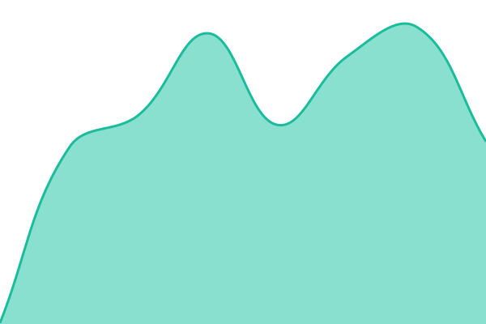

# [📈 Live Status](https://status.aviobot.app): <!--live status--> **🟧 Partial outage**

This repository contains the open-source uptime monitor and status page for [Upptime](https://upptime.js.org), powered by [Upptime](https://github.com/upptime/upptime).

With [Upptime](https://upptime.js.org), you can get your own unlimited and free uptime monitor and status page, powered entirely by a GitHub repository. We use [Issues](https://github.com/upptime/upptime/issues) as incident reports, [Actions](https://github.com/upptime/upptime/actions) as uptime monitors, and [Pages](https://status.aviobot.app) for the status page.

<!--start: status pages-->
<!-- This summary is generated by Upptime (https://github.com/upptime/upptime) -->
<!-- Do not edit this manually, your changes will be overwritten -->
<!-- prettier-ignore -->
| URL | Status | History | Response Time | Uptime |
| --- | ------ | ------- | ------------- | ------ |
|  [aviobot.app](https://www.aviobot.app) | 🟩 Up | [aviobot-app.yml](https://github.com/fudgemss/avio-status/commits/HEAD/history/aviobot-app.yml) | 

 747ms
     
 | 

<a href="https://status.aviobot.app/history/aviobot-app">100.00%</a>
    

|  [Dashboard](https://dashboard.aviobot.app) | 🟥 Down | [dashboard.yml](https://github.com/fudgemss/avio-status/commits/HEAD/history/dashboard.yml) | 

 0ms
     
 | 

<a href="https://status.aviobot.app/history/dashboard">0.00%</a>
    

|  [Avio Bot](tcp:85.202.160.163:2224) | 🟥 Down | [avio-bot.yml](https://github.com/fudgemss/avio-status/commits/HEAD/history/avio-bot.yml) | 

 280ms
     
 | 

<a href="https://status.aviobot.app/history/avio-bot">25.86%</a>
    

|  [Database](tcp:85.202.160.163:2224) | 🟥 Down | [database.yml](https://github.com/fudgemss/avio-status/commits/HEAD/history/database.yml) | 

 293ms
     
 | 

<a href="https://status.aviobot.app/history/database">25.97%</a>
    

<!--end: status pages-->

[**Visit our status website →**](https://status.aviobot.app)

## 📄 License

- Powered by: [Upptime](https://github.com/upptime/upptime)
- Code: [MIT](./LICENSE) © [Anand Chowdhary](https://anandchowdhary.com)
- Data in the `./history` directory: [Open Database License](https://opendatacommons.org/licenses/odbl/1-0/)
